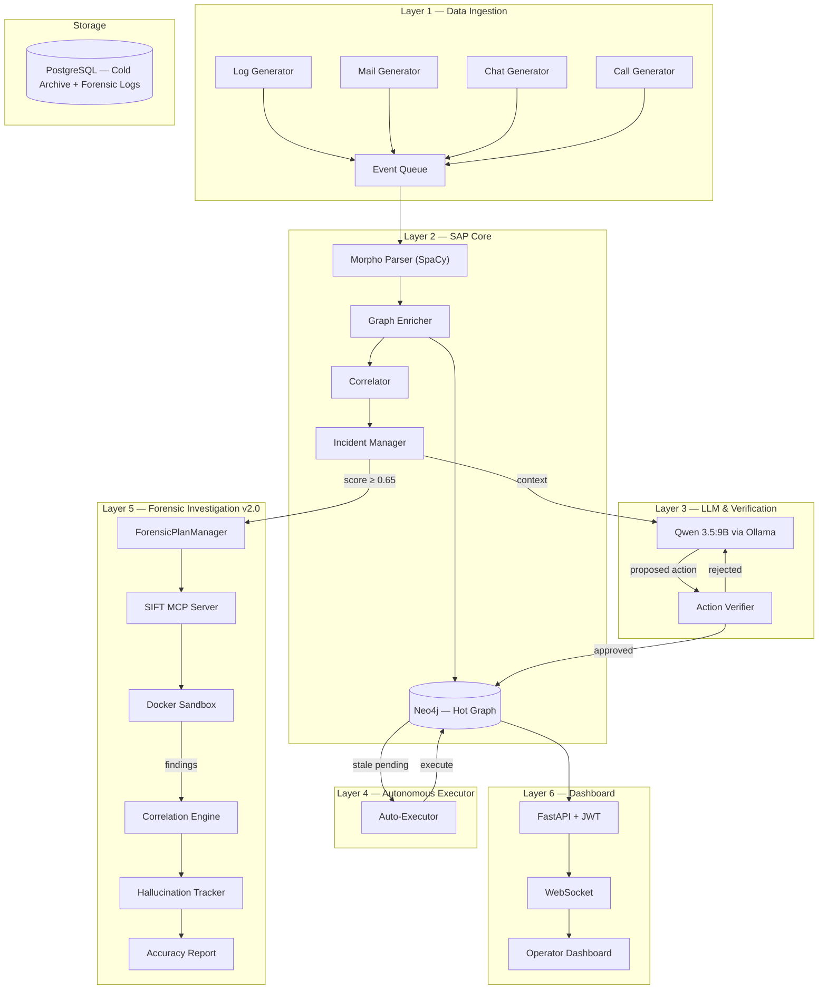

# ⛨ Paladin — Autonomous Corporate Security System

> **v2.0** · Local LLM · SIFT Forensics · Self-Correcting Agent

Paladin is an end-to-end, locally hosted, autonomous enterprise security system with a forensic investigation layer. It ingests corporate telemetry (logs, emails, chats, calls), parses it via NLP, maps entities to a Neo4j knowledge graph, correlates suspicious activities, and leverages a local LLM (Qwen 3.5:9B) for threat analysis and autonomous response.

Version 2.0 adds a **SIFT Workstation-based forensic layer** for deep incident investigation using the **Custom MCP Server** architectural pattern.

---

## 🏗️ System Architecture



---

## ✨ Core Features (v1.0)

| Feature | Description |
|---------|-------------|
| **Multi-Modal Ingestion** | System logs, corporate emails, messenger chats, voice call transcripts |
| **Morpho-Semantic Parsing** | SpaCy/Natasha + custom security vocabulary for risk/sentiment scoring |
| **Graph Correlation** | Neo4j Cypher traversals detect complex patterns (mass download, brute force, insider chains) |
| **Local LLM Analysis** | Qwen 3.5:9B generates incident summaries and proposes actions (NOTIFY, FLAG, ISOLATE, BLOCK, BLOCK_IP, QUARANTINE_FILE, REVOKE_SESSIONS) |
| **Multi-Signal Verifier** | Gates LLM actions via severity policies + quality metrics (Entropy, Semantic Coherence) |
| **Dual-Mode Response** | Toggle via UI: **Autonomous** (instant enforcement) or **Human-in-the-Loop** (60s operator review) |
| **Auto-Executor** | Background service enforces proposed actions after operator timeout |
| **Alert Deduplication** | Aggregates related events into single incidents to prevent alert fatigue |
| **Real-Time Dashboard** | FastAPI + WebSocket UI for SOC operators — incidents, graph viewer, scenario triggers |
| **E2EE** | Self-signed TLS for HTTPS/WSS dashboard access |
| **Internal mTLS** | Secure Neo4j (Bolt+SSC) and PostgreSQL (SSLMode) via local Certificate Authority |
| **JWT Authentication** | All API endpoints and WebSocket connections require valid tokens |

---

## 🔬 Forensic Layer (v2.0)

### How It Works

When an incident's severity score crosses the threshold (≥ 0.65), Paladin switches from **Tool Mode** (quick inline analysis) to **Pipeline Mode** — launching a full forensic investigation:

```
1. Incident triggers Pipeline Mode (score ≥ 0.65)
2. SandboxManager creates isolated Docker container
3. ForensicPlanManager asks Qwen to generate investigation plan
4. SIFT MCP Server executes each step inside the sandbox
5. Findings stored in Neo4j with [:PRODUCED] edges
6. Self-Correction Loop checks for contradictions after each finding
7. Correlation Engine detects cross-source discrepancies
8. Hallucination Tracker verifies LLM claims against raw tool output
9. Accuracy Report generated with verification metrics
```

### Security Boundaries (4 layers, defense-in-depth)

| # | Boundary | Mechanism | Protection |
|---|----------|-----------|------------|
| 1 | **Action Verifier** | Programmatic filter | SAFE / REQUIRES_APPROVAL / FORBIDDEN classification. Shell injection detection (`;`, `&&`, `\|`, `` ` ``, `$()`). Path traversal prevention. Default-deny policy. |
| 2 | **MCP Server API** | API surface limitation | No destructive functions exist in the codebase. No `rm`, `dd`, `chmod`, `mkfs`, shell access. Only 11 read-only functions exposed. |
| 3 | **Sandbox Filesystem** | Kernel-level isolation | `/evidence` mounted with `:ro` flag. OS-level write prohibition. |
| 4 | **Sandbox Network** | Docker network isolation | `network: none`. Zero outbound connectivity. No DNS, no exfiltration surface. |

Additional hardening: `--security-opt no-new-privileges`, `--read-only`, `--cap-drop ALL`, `--pids-limit 256`, CPU/memory limits, tmpfs for scratch work.

### MCP Functions (Custom MCP Server)

| Function | Backend Tool | Evidence Type | Output |
|----------|-------------|---------------|--------|
| `get_file_metadata` | stat + file | Disk | FileMetadata (name, size, timestamps, MIME, permissions) |
| `compute_hash` | md5sum / sha256sum | Disk | HashResult (path, algorithm, hash, size) |
| `extract_strings` | strings | Disk | StringsList + SuspiciousPattern IOC detection (IPs, URLs, emails) |
| `analyze_process_list` | Volatility3 pslist | Memory | ProcessList + suspicious process flagging |
| `scan_network_connections` | Volatility3 netscan | Memory | ConnectionList + external connection filtering |
| `extract_loaded_modules` | Volatility3 dlllist | Memory | ModuleList (loaded DLLs per PID) |
| `parse_mft` | analyzeMFT | Disk | MFTResult (NTFS timeline + timestomping anomalies) |
| `parse_prefetch` | prefetch_parser | Disk | PrefetchResult (execution history + suspicious executables) |
| `extract_registry_hive` | regripper | Disk | RegistryResult (keys, autorun entries, recent activity) |
| `parse_pcap` | tshark | Network | PCAPResult (DNS queries, HTTP requests, suspicious traffic) |
| `extract_browser_artifacts` | hindsight | Disk | BrowserResult (history, downloads, cookies, saved creds) |

All outputs are **typed Pydantic models** — the LLM agent never receives raw shell output.

### Self-Correction Loop

After each finding, Qwen reviews all previous findings for contradictions:
- **Contradiction detected** → Creates `[:CONTRADICTS]` edge in Neo4j
- **Rerun required** → Adds RECHECK TodoItem, increments plan iteration
- **Iteration limit** (default 5) → Finalizes with `COMPLETED_WITH_GAPS` status
- **Version history** → Each iteration creates a `[:HAS_VERSION]` snapshot

### Correlation Engine (LLM-free)

Deterministic cross-source contradiction detection:

| Detection | Description | Example |
|-----------|-------------|---------|
| **Ghost Process** | Process in memory but no disk artifacts | Rootkit, process hollowing |
| **Temporal Paradox** | Timeline conflicts between sources | File created after its hash appeared in network traffic |
| **Registry Mismatch** | Execution evidence without installation record | Portable or dropped malware |
| **Invisible Connection** | Network connection without DNS query | Direct IP C2 or DNS tunneling |

### Hallucination Tracker

Verifies every LLM finding against actual tool output:
- **Exact match**: `evidence_quote` found verbatim in tool output
- **Case-insensitive match**: Same content, different casing
- **Semantic match**: ≥70% word overlap in evidence quote
- **Accuracy Report**: Total/verified/unverified findings, hallucination rate, confidence-accuracy correlation

---

## 🧱 Technology Stack

| Component | Technology | Purpose |
|-----------|-----------|---------|
| LLM | Qwen 3.5:9B via Ollama | Incident analysis, forensic planning, self-correction |
| Knowledge Graph | Neo4j 5.18 + APOC | Entity relationships, incidents, forensic plans, findings |
| Archive DB | PostgreSQL 16 | Cold storage, tool execution logs, accuracy metrics |
| API | FastAPI + Uvicorn | Dashboard REST + WebSocket |
| NLP | SpaCy + Natasha | Morpho-semantic parsing |
| Auth | JWT + mTLS | Dashboard authentication, internal DB encryption |
| Sandbox | Docker (custom SIFT image) | Isolated forensic tool execution |
| Forensic Tools | Volatility3, Sleuthkit, tshark, regripper, plaso | Evidence analysis inside sandbox |

---

## 📁 Project Structure

```
paladin/
├── main.py                     # Orchestrator — event loop, pipeline wiring
├── config/
│   └── settings.py             # PydanticSettings (35+ config vars)
├── graph/
│   ├── schema.py               # Neo4j schema: 16 node labels, 25+ rel types
│   └── neo4j_client.py         # 30+ async CRUD methods (incidents + forensic)
├── llm/
│   ├── ollama_client.py        # Async Qwen interface
│   └── prompts.py              # System prompt + incident prompt builder
├── sap/
│   ├── morpho_parser.py        # SpaCy/Natasha NLP pipeline
│   ├── graph_enricher.py       # Event → Neo4j entity mapping
│   ├── correlator.py           # Multi-pattern correlation engine
│   ├── incident_manager.py     # Incident lifecycle + mode routing (v2.0)
│   └── auto_executor.py        # Autonomous timeout enforcement
├── verifier/
│   ├── verifier.py             # Multi-signal action gating
│   └── action_registry.py      # Action definitions + severity levels
├── forensic/                   # ── v2.0 Forensic Layer ──
│   ├── action_verifier.py      # Security boundary #1 (SAFE/APPROVAL/FORBIDDEN)
│   ├── mcp_server.py           # SIFT MCP Server — 11 typed functions
│   ├── mcp_types.py            # 25+ Pydantic models for MCP I/O
│   ├── sandbox_manager.py      # Docker sandbox lifecycle (boundaries #3, #4)
│   ├── plan_manager.py         # ForensicPlanManager + self-correction loop
│   ├── correlation_engine.py   # Cross-source contradiction detection
│   ├── hallucination_tracker.py # Finding verification + accuracy report
│   ├── prompts.py              # Planning, execution, self-check prompts
│   └── pg_store.py             # PostgreSQL: tool_executions, accuracy_metrics
├── dashboard/
│   ├── api.py                  # FastAPI app + forensic endpoints
│   └── frontend/index.html     # SOC operator dashboard
└── requirements.txt            # Python dependencies

docker/
└── sift-sandbox/
    └── Dockerfile              # SIFT forensic tools image

tests/
├── test_forensic.py            # Forensic layer tests (63 checks)
└── test_total.py               # Total system test (153 checks)
```

---

## 🚀 Getting Started

### Prerequisites

- Python 3.10+
- Docker & Docker Compose
- [Ollama](https://ollama.ai/) with `qwen3.5:9b` model
- NVIDIA GPU (recommended for LLM inference)

### Quick Start

```bash
# 1. Install dependencies
pip install -r paladin/requirements.txt
python -m spacy download en_core_web_sm

# 2. Start infrastructure
docker run -d --name paladin-neo4j -p 7474:7474 -p 7687:7687 \
  -e NEO4J_AUTH=neo4j/changeme123 neo4j:latest

# 3. Start Ollama
ollama serve && ollama pull qwen3.5:9b

# 4. Run demo
python demo.py

# 5. Open dashboard
# https://localhost:8888  (admin / admin)
```

### Full Docker Deployment (with TLS + PostgreSQL + SIFT)

```bash
cp paladin/.env.example .env
python setup_internal_tls.py
docker-compose -f docker-compose.paladin.yml up -d

# Build SIFT sandbox image
docker-compose -f docker-compose.paladin.yml --profile build-only build sift-sandbox
```

### Run Tests

```bash
# Forensic layer tests (63 checks)
python tests/test_forensic.py

# Total system test (153 checks)
python tests/test_total.py
```

---

## 🧪 Simulated Attack Scenarios

14 built-in threat scenarios for testing:

| Source | Scenarios |
|--------|-----------|
| **Logs** | `brute_force`, `data_exfiltration`, `insider_threat`, `privilege_escalation` |
| **Emails** | `phishing`, `data_leak_email`, `social_engineering`, `external_exfil` |
| **Chat** | `insider_chat`, `credential_sharing`, `competitor_contact` |
| **Calls** | `data_theft_call`, `insider_recruitment`, `bribery_call` |

Trigger via dashboard UI or API: `POST /api/scenario`

---

## 🗄️ Neo4j Graph Schema

### Node Labels (16)

| Label | Domain | Description |
|-------|--------|-------------|
| `Employee` | Core | Corporate personnel with UID, department, clearance |
| `Device`, `File`, `IPAddress` | Core | Infrastructure entities |
| `Email`, `Message`, `Call` | Core | Communication events |
| `LogEvent` | Core | System/application logs with risk scores |
| `Incident` | Core | Correlated security incidents |
| `Department`, `Role`, `ClearanceLevel` | Org | Organizational hierarchy |
| `ForensicPlan` | Forensic | Investigation plan with iteration tracking |
| `TodoItem` | Forensic | Individual investigation step |
| `Finding` | Forensic | Evidence-backed conclusion with confidence score |
| `ToolExecution` | Forensic | MCP function execution record |

### Key Relationships

| Relationship | Domain | Connects |
|-------------|--------|----------|
| `SENT_EMAIL`, `SENT_MESSAGE`, `MADE_CALL` | Core | Employee → Communication |
| `USES_DEVICE`, `ACCESSED_FILE` | Core | Employee → Assets |
| `INVOLVED_IN`, `TRIGGERED_BY` | Core | Entity → Incident |
| `HAS_FORENSIC_PLAN` | Forensic | Incident → ForensicPlan |
| `CONTAINS_TODO` | Forensic | ForensicPlan → TodoItem |
| `PRODUCED` | Forensic | ForensicPlan → Finding |
| `CONTRADICTS` | Forensic | Finding ↔ Finding |
| `HAS_VERSION` | Forensic | ForensicPlan → ForensicPlan (snapshot) |

---

## 📊 API Endpoints

### Core API

| Method | Endpoint | Description |
|--------|----------|-------------|
| POST | `/api/login` | JWT authentication |
| GET | `/api/incidents` | List open incidents |
| POST | `/api/incidents/action` | Approve/reject incident |
| GET | `/api/graph/{incident_id}` | Get incident subgraph |
| POST | `/api/scenario` | Trigger test scenario |
| POST | `/api/config/mode` | Toggle autonomous/HITL mode |
| GET | `/api/status` | System health check |
| WS | `/ws` | Real-time event stream |

### Forensic API (v2.0)

| Method | Endpoint | Description |
|--------|----------|-------------|
| GET | `/api/forensic/plan/{plan_id}` | Get forensic plan with items + findings |
| GET | `/api/forensic/incident/{incident_id}` | Get forensic plan for incident |
| GET | `/api/forensic/accuracy/{plan_id}` | Generate accuracy report |
| POST | `/api/forensic/plan/{plan_id}/approve` | Approve pending forensic action |

---

## 📜 License

[MIT License](LICENSE)
